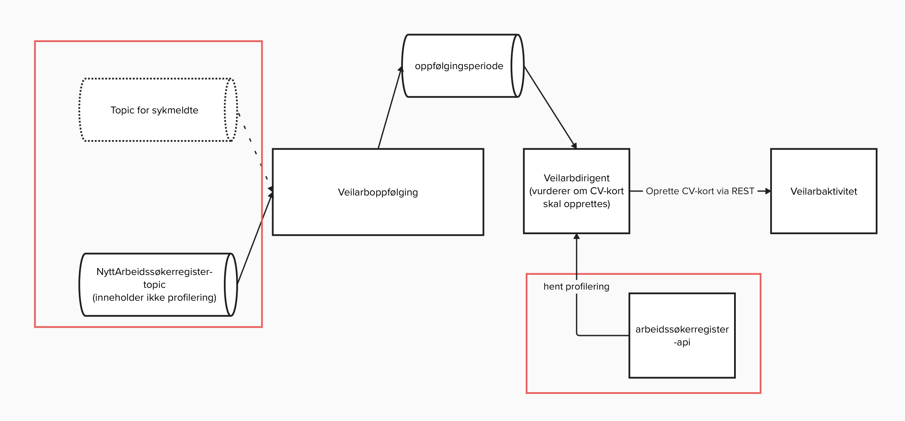

# Ny master for arbeidssøkerregister
## Deltagere
 - Hans Petter Simonsen (@holymaloney)
 - Johanne Tronstad (@johatr)
 - Mads Lee Giil (@madsleegiil)

## Problemstilling
Team PAW har overtatt som master for arbeidssøkerregisteret og dekoblet seg fra Arena. 
Arena reagerer på meldinger fra arbeidssøkerregistreringa og vedlikeholder interne 
statuser. Disse statusendringene flyter inn til veilarboppfølging asynkront slik at vi
får startet oppfølgingsperioder, men dette kan ta mer enn ett minutt. Det skaper 
problemer for brukerne. 

Veilarbdirigent har ansvar for å opprette CV-kort i Aktivitetsplanen for brukere som
har kommet inn i arbeidsoppfølging for første gang. Et kriterie for å opprette et slikt 
kort har vært at brukeren hadde gjort en egenvurdering og fått foreslått én av følgende
innsatsgrupper: "STANDARDINNSATS", "SITUASJONSBESTEMT_INNSATS" eller 
"BEHOV_FOR_ARBEIDSEVNEVURDERING" (profilering). Veilarbdirigent hentet denne informasjonen fra 
veilarbregistrering. Veilarbregistrering har ikke lenger disse opplysningene, så
veilarbdirigent har ikke nok data for å kunne opprette CV-kort automatisk. 

## Løsningsalternativer

### Alternativ 1
Det første alternativet er å bytte ut kallet som veilarbdirigent gjør til 
veilarbregistrering med to kall til nytt-arbeidssøkerregister. Ellers vil 
arkitekturen være lik. 

Ulempen med dette alternativet er at man da ikke løser problemet med forsinket oppstart
av oppfølgingsperioder. Fordelen er at det antas å være raskere å utvikle.

### Alternativ 2
Det andre alternativet er å starte å konsumere et topic som nytt-arbeidssøkerregister 
publiserer meldinger på. Arbeidssøkerperioder og profilering er per i dag publisert på
separate topics, men vi har bedt om tilgang til å konsumere fra et topic der disse
opplysningene er sammenstilt. [EDIT har fått beskjed om at dette ikke er mulig] Veilarboppfølging kan så sammenstille informasjonen med
egne opplysninger om oppfølgingsperioder og publisere en rik melding som inneholder
alle opplysninger veilarbdirigent trenger får å avgjøre om CV-kort skal opprettes.

Fordelen med dette alternativet er at det også løser problemet med forsinket  oppstart
av oppfølgingsperioder. Alternativet er også mer framtidsrettet siden det er et steg
for å kunne koble oss fra Arena. "Topic for sykmeldte" er ikke klar for produksjon, 
i dag gjør veilarbregistrering et REST-kall til veilarboppfølging for å starte 
oppfølging av sykemeldte. 

## Alternativ 3
Siden informasjon om profilering blir publisert på et annet topic enn nye arbeidssøkerperioder, 
vil det innebære en del ekstra kompleksitet å sammenstille denne informasjonen i veilarboppfølging,
og veilarboppfølging har ikke selv behov for profilering.
I alternativ 3, lar vi veilarbdirigent innhente profileringen via et synkront kall til
arbeidssøkerregisteret.

### Avgjørelse
Vi beslutter å implementere alternativ 3. Alternativ 3 antas å ta noe mer tid å
implementere, men er mer framtidsrettet. Konsumering av nytt topic fra 
nytt-arbeidssøkerregister må uansett gjøres når Arena stenges ned. Ved å lytte på
det topic-et nå, løser vi problemet med forsinket oppstart av arbeidsoppfølging.
Siden veilarbdirigent uansett trenger mer informasjon enn det som er tilgjengelig på
arbeidssøkerperiode-topicet, lar vi veilarbdirigent håndtere den ekstra kompleksiteten
det er å sammenstille arbeidssøkerperiode med profilering.

### Betraktninger
Det er designmessig uhelding at vi drar inn elementer fra arbeidssøkerregisteret og 
eSyfo inn i oppfølgingsdomenet. På sikt kan man se for seg å lage en ACL som leser 
de to topic-ene og oversetter dette til oppfølgingshendelser som så kan konsumeres
av veilarboppfølging.

Vi vurderte å la veilarboppfølging bestille CV-aktivitetskort
via AKAAS, men ønsker ikke å dra aktivitetskort-domenet inn i veilarboppfølging.
En mulig forbedring i framtida er å la veilarbdirigent bestille aktivitetskort via 
AKAAS framfor å opprette det med et REST-kall til veilarbaktivitet.